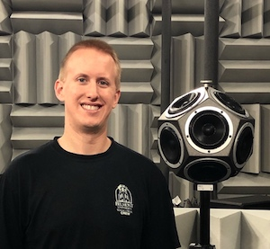

Welcome to my professional portfolio! I am an audio engineer with interests in digital signal processing, machine learning, acoustics, and audio research. See the blog posts below for information on my personal projects, professional experience, research, and resume.

  

## Links
* [LinkedIn Profile](https://www.linkedin.com/in/ryan-miller-1aa8355a/)
* [GitHub Page](https://github.com/rjmiller927)
* Get started with Machine Learning for audio [here!](https://github.com/drscotthawley/ml-audio-start)

 All pages on the blog, including this one, use [Markdown](https://guides.github.com/features/mastering-markdown/).

